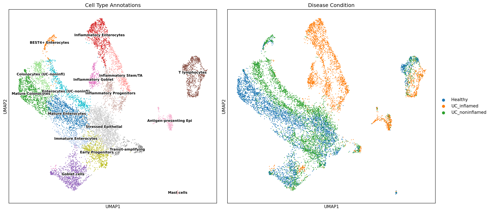

# Single-Cell RNA-Seq Analysis: Colonic Epithelium in Ulcerative Colitis

[](https://opensource.org/licenses/MIT)
[](https://python.org)
[](https://scanpy.readthedocs.io)

## Project Overview

This project implements a complete single-cell RNA-sequencing analysis pipeline to characterize epithelial cell populations in ulcerative colitis (UC). Using publicly available data from Parikh et al. (2019), I analyze 11,000+ colonic epithelial cells across healthy and diseased tissue states to identify inflammation-specific cell populations and their transcriptional signatures.

**Objective:** Build production-level Python skills in single-cell analysis while generating biologically meaningful insights into inflammatory bowel disease at cellular resolution.

**Key Finding:** Unsupervised clustering—blind to patient condition labels—independently separates cells into disease-specific populations, with inflammatory cell states showing >99% condition specificity. This demonstrates that inflammation creates transcriptionally distinct cell populations absent in healthy tissue.


*Left: 17 cell types identified through marker-based annotation. Right: Same cells colored by disease condition, showing condition-specific clustering.*

---

## Dataset

**Source:** [GSE116222](https://www.ncbi.nlm.nih.gov/geo/query/acc.cgi?acc=GSE116222) from Parikh et al., *Cell* (2019)

**Publication:** Parikh K, Antanaviciute A, Fawkner-Corbett D, et al. "Colonic epithelial cell diversity in health and inflammatory bowel disease." *Cell*. 2019;179(5):1150-1164.

| Attribute | Value |
|-----------|-------|
| **Total cells** | 11,135 (post-QC) |
| **Genes** | 22,559 |
| **Samples** | 9 patients |
| **Conditions** | Healthy (n=3), UC Inflamed (n=3), UC Non-inflamed (n=3) |
| **Tissue** | Colonic epithelium (EPCAM+ sorted) |
| **Platform** | 10x Genomics 3' v2 |

---

## Analysis Pipeline

### Completed Modules

| Week | Module | Description | Status |
|------|--------|-------------|--------|
| 1 | Data Loading | GEO download, AnnData structure, initial exploration | ✅ Complete |
| 2 | Quality Control | MT% filtering, gene/cell thresholds, QC visualization | ✅ Complete |
| 3 | Preprocessing | Normalization, log transformation, HVG selection, scaling | ✅ Complete |
| 3 | Dimensionality Reduction | PCA, neighborhood graph, UMAP embedding | ✅ Complete |
| 3 | Clustering | Leiden algorithm, resolution optimization, cluster validation | ✅ Complete |
| 4 | Cell Type Annotation | Marker-based annotation, differential expression, validation | ✅ Complete |
| 5 | Differential Expression | Pseudobulk analysis, condition comparisons | 🔄 In Progress |
| 6 | Pathway Analysis | Gene set enrichment, biological interpretation | ⏳ Planned |

### Methods Summary

**Quality Control**
- Filtered cells with >20% mitochondrial content (dying/stressed cells)
- Removed cells with <200 or >6000 detected genes
- Excluded genes detected in <3 cells
- Result: 11,135 cells retained (99.6% of input)

**Preprocessing**
- Library size normalization (10,000 counts/cell target)
- Log1p transformation
- Highly variable gene selection (n=3,000 genes, Seurat v3 method)
- Z-score scaling with regression of MT% and total counts

**Dimensionality Reduction & Clustering**
- PCA: 50 components computed, 30 used for downstream analysis
- Neighborhood graph: k=15 neighbors
- UMAP: min_dist=0.5 for visualization
- Leiden clustering: resolution=1.0 yielding 17 clusters

**Cell Type Annotation**
- Literature-based marker panels from Parikh et al. (2019) and Smillie et al. (2019)
- Differential expression (Wilcoxon rank-sum test) for marker discovery
- Cell type scoring using `sc.tl.score_genes()`
- Manual annotation validated against condition enrichment

---

## Key Results

### Cell Type Composition

17 distinct cell populations identified across 5 major lineages:

| Lineage | Cell Types | Total Cells |
|---------|------------|-------------|
| **Absorptive** | Mature Enterocytes, Mature Colonocytes, Enterocytes (UC-noninfl), Colonocytes (UC-noninfl), Immature Enterocytes, Inflammatory Enterocytes, BEST4+ Enterocytes | 5,002 |
| **Secretory** | Goblet cells, Inflammatory Goblet | 1,188 |
| **Stem/Progenitor** | Early Progenitors, Transit-amplifying, Inflammatory Stem/TA, Inflammatory Progenitors | 1,703 |
| **Specialized** | Stressed Epithelial, Antigen-presenting Epithelial | 1,939 |
| **Non-epithelial** | T lymphocytes, Mast cells | 944 |

### Inflammation-Specific Cell States

Four cell populations exist almost exclusively in inflamed tissue:

| Cell Type | N Cells | % UC Inflamed | Key Markers |
|-----------|---------|---------------|-------------|
| Inflammatory Enterocytes | 795 | 99.1% | LCN2, CXCL1, CXCL8, DUOX2 |
| Inflammatory Goblet | 308 | 99.4% | LCN2, MUC2, TFF3, REG4 |
| Inflammatory Stem/TA | 464 | 99.6% | LCN2, MKI67, OLFM4 |
| Inflammatory Progenitors | 439 | 94.3% | LCN2, LEFTY1, CREM |

**Total: 2,006 inflammatory cells (18% of dataset)**

### Biological Insights

1. **LCN2 as dominant inflammation marker** - Emerged as top differentially expressed gene across all inflammatory clusters without explicit searching. LCN2 (lipocalin-2/NGAL) is a validated clinical biomarker for IBD.

2. **Field effect in UC** - Non-inflamed UC tissue is transcriptionally distinct from healthy tissue, with dedicated cell populations (Enterocytes UC-noninfl, Colonocytes UC-noninfl). Disease extends beyond visible inflammation.

3. **BEST4+ cell depletion** - BEST4+ enterocytes comprise 2.1% of cells overall but only 0.2% of inflamed tissue, suggesting selective loss during inflammation.

4. **MHC-II upregulation** - Antigen-presenting epithelial cluster shows elevated HLA-DRA, HLA-DPB1, CD74, indicating epithelial antigen presentation to T cells during inflammation.

5. **Immune contamination** - 944 cells (8.5%) identified as T lymphocytes and mast cells despite EPCAM sorting, demonstrating importance of computational QC.

---

## Repository Structure

```
scrna-seq-ulcerative-colitis/
├── README.md
├── LICENSE
├── requirements.txt
├── environment.yml
│
├── data/
│   ├── raw/                      # Original GEO downloads (not tracked)
│   └── processed/                # Processed AnnData objects
│       ├── GSE116222_raw.h5ad
│       ├── GSE116222_qc.h5ad
│       ├── GSE116222_preprocessed.h5ad
│       ├── GSE116222_clustered.h5ad
│       └── GSE116222_annotated.h5ad
│
├── scripts/
│   ├── 01_download_data.py       # GEO data acquisition
│   ├── 02_load_data.py           # AnnData creation
│   ├── 03_qc_visualization.py    # Quality control metrics
│   ├── 04_preprocessing.py       # Normalization, HVGs, scaling
│   ├── 05_dimensionality_reduction.py  # PCA, UMAP, clustering
│   ├── 06_cell_type_annotation.py      # Marker analysis, DE
│   └── 06b_apply_annotations.py        # Final annotation assignment
│
├── figures/
│   ├── 01_qc_violin_pretfilter.png
│   ├── 02_qc_scatter.png
│   ├── 03_qc_violin_postfilter.png
│   ├── 04_hvg_plot.png
│   ├── 05_pca_variance.png
│   ├── 06_pca_embeddings.png
│   ├── 07_umap_samples.png
│   ├── 08_umap_condition.png
│   ├── 09_umap_qc_metrics.png
│   ├── 10_resolution_comparison.png
│   ├── 11_umap_clusters.png
│   ├── 12_marker_umap.png
│   ├── 13_marker_dotplot.png
│   ├── 14_cluster_markers_ranked.png
│   ├── 15_marker_heatmap.png
│   ├── 16_celltype_scores.png
│   └── 17_cell_type_annotations.png
│
├── results/
│   ├── cluster_markers.csv       # Top DE genes per cluster
│   ├── cell_type_by_condition.csv
│   └── annotation_summary.csv
│
└── docs/
    ├── week1_data_loading.md
    ├── week2_quality_control.md
    ├── week3_clustering.md
    ├── week4_cell_type_annotation.md
    └── scanpy_command_reference.md
```

---

## Getting Started

### Prerequisites

- Python 3.10+
- 8GB RAM minimum (16GB recommended)
- ~2GB disk space for processed data

### Installation

```bash
# Clone repository
git clone https://github.com/yourusername/scrna-seq-ulcerative-colitis.git
cd scrna-seq-ulcerative-colitis

# Create conda environment
conda env create -f environment.yml
conda activate scrna-uc

# Or install with pip
pip install -r requirements.txt
```

### Running the Analysis

```bash
# Execute scripts sequentially
python scripts/02_load_data.py
python scripts/03_qc_visualization.py
python scripts/04_preprocessing.py
python scripts/05_dimensionality_reduction.py
python scripts/06_cell_type_annotation.py
python scripts/06b_apply_annotations.py
```

### Requirements

```
scanpy>=1.9.0
anndata>=0.8.0
numpy>=1.21.0
pandas>=1.3.0
matplotlib>=3.5.0
seaborn>=0.11.0
scipy>=1.7.0
scikit-learn>=1.0.0
leidenalg>=0.8.0
```

---

## Tools & Technologies

| Category | Tools |
|----------|-------|
| **Core Analysis** | Scanpy, AnnData, NumPy, Pandas |
| **Visualization** | Matplotlib, Seaborn |
| **Statistics** | SciPy, scikit-learn |
| **Clustering** | Leiden algorithm (leidenalg) |
| **Dimensionality Reduction** | PCA, UMAP |
| **Environment** | Conda, Python 3.10 |

---

## References

1. Parikh K, Antanaviciute A, Fawkner-Corbett D, et al. **Colonic epithelial cell diversity in health and inflammatory bowel disease.** *Cell*. 2019;179(5):1150-1164. [doi:10.1016/j.cell.2019.10.027](https://doi.org/10.1016/j.cell.2019.10.027)

2. Smillie CS, Biton M, Ordovas-Montanes J, et al. **Intra- and Inter-cellular Rewiring of the Human Colon during Ulcerative Colitis.** *Cell*. 2019;178(3):714-730. [doi:10.1016/j.cell.2019.06.029](https://doi.org/10.1016/j.cell.2019.06.029)

3. Wolf FA, Angerer P, Theis FJ. **SCANPY: large-scale single-cell gene expression data analysis.** *Genome Biology*. 2018;19:15. [doi:10.1186/s13059-017-1382-0](https://doi.org/10.1186/s13059-017-1382-0)

---

## Author

**Vigneshwaran Muthuraman**

MSc Bioinformatics | Computational Biology

- Email: vigneshwaran0594@gmail.com
- GitHub: [github.com/yourusername](https://github.com/yourusername)
- LinkedIn: [linkedin.com/in/yourprofile](https://linkedin.com/in/yourprofile)

---

## License

This project is licensed under the MIT License - see the [LICENSE](LICENSE) file for details.

---

## Acknowledgments

- Original dataset from Parikh et al. (2019), available through NCBI GEO
- Scanpy development team for the excellent single-cell analysis framework
- Single-cell genomics community for methodological guidance
